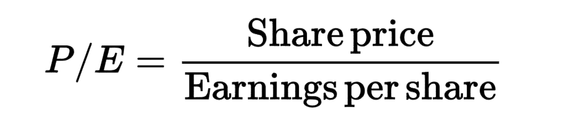
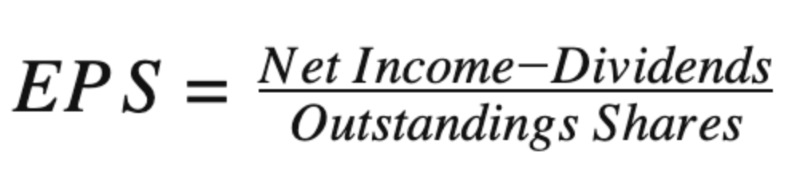
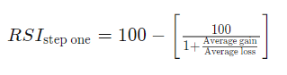
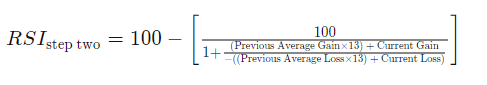
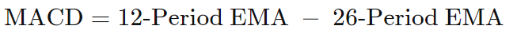
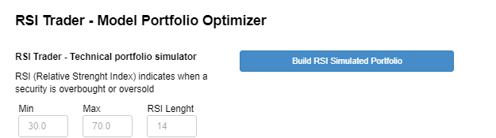

# Powerfolio!
Bringing power to your portfolio building needs


Creators: 
- Illya Nayshevsky, Ph.D.
- Nathan S. Froemming, Ph.D.
- Ludovic Schneider
- Chandra Kandiah
---


#### Table of Contents

* [Overview](#overview)
* [Theory](#theory)
   * [Fudamental Analysis](#fundamental-analysis)
   * [Technical Analysis](#technical-analysis)
   * [Traditional Analysis](#tradiational-analysis)
* [Installation](#installation)
* [APIs](#apis)
* [Computational Methods](#computational-methods)
---


## Overview

#### What is Powerfolio!?
**Powerfolio!** is screener, portfolio builder and analyzer for S&P 500 securities.
Powerfolio! implements fundamental analysis, technical analysis and tradiational portfolio analysis methods such as Sharpe Ratio and Efficient Frontier in order to allow you to select the best *power*-folio for your financial needs.


<br>

---


## Theory

## Fundamental Analysis
#### P/E - Price to Earnings Ratio
The [price-to-earnings ratio (P/E ratio)](https://www.investopedia.com/terms/p/price-earningsratio.asp) is a method used to value a company by comparing the share price to the Earnings per Share (EPS). The price-to-earnings ratio is used a multiplier for company earnings. High P/E ratio means that the stock value is high compared to corporate earnings, and that the company may be overvalues, and vis-versa. 

*Formula was obtained from [Investopedia](https://www.investopedia.com/terms/p/price-earningsratio.asp)*


<br>

#### EPS - Earnings per Share
[Earnings per share (EPS)](https://www.investopedia.com/terms/e/eps.asp) is generally calculated by dividing company's profit by the outstanding shares of its common stock. EPS is a general way for a company to report it's profitability adjusted to it's marker capitalization. It is one of the general ways to evaluate corporate earnings.

*Formula was obtained from [Investopedia](https://www.investopedia.com/terms/e/eps.asp)*


<br>

#### Dividnend
A [dividend](https://www.investopedia.com/terms/d/dividend.asp) is the distribution of a company's earnings to its shareholders. Dividents are paid directly to shareholders of the comapany on periodic basis and the amout is determined by the board of directors.
<br>
<br>


## Technical Analysis
#### RSI - Relative Strenght Index
[Relative Strenght Index](https://www.investopedia.com/terms/r/rsi.asp), better known as RSI is a technical indicator used to determine is a particular security is overbought or oversold. It measures the magnitude of price change of the asset; and is an oscillator that moves between 0 and 100. RSI was developed by J. Welles Wilder Jr. in 1978.

*Formulas were obtained from [Investopedia](https://www.investopedia.com/terms/r/rsi.asp)*




<br>


#### MACD
[Moving average convergence divergence (MACD)](https://www.investopedia.com/terms/m/macd.asp) is a trend-following momentum indicator that shows the relationship between two moving averages of a security’s price. The MACD is calculated by subtracting the 26-period exponential moving average (EMA) from the 12-period EMA.




[Expoenential moving average](https://www.investopedia.com/terms/e/ema.asp) is a [moving average](https://www.investopedia.com/terms/m/movingaverage.asp) that places a greater weight to most recent data points and less to the older data points. In finance, EMA reacts more significantly to recent price changes than a [simple moving average (SMA)](, which applies an equal weight to all observations in the period.
In statistics, a moving average (MA), also known as simple moving average (SMA) in finance, is a calculation used to analyze data points by creating a series of averages of different subsets of the full data set. 
<br>


## Traditional Analysis
#### Sharpe Ratio

<br><br>
---

## Installation
### Anaconda
[Anaconda](https://docs.anaconda.com/)

### pandas
pandas is an open source, BSD-licensed library providing high-performance, easy-to-use data structures and data analysis tools for the Python programming language. [[Pandas Overview](https://pandas.pydata.org/pandas-docs/stable/getting_started/index.html)]

#### Installation
```python
conda install pandas
```


### NumPy
The fundamental package for scientific computing with Python [[Numpy Overview](https://numpy.org/)]

#### Installation
```python
conda install numpy
```


### Panel
A high-level app and dashboarding solution for Python [[Holoviz Panel Overview](https://panel.holoviz.org/)]

#### Installation
```python
conda install -c pyviz panel
```


### Plotly
Interactive charts and maps for Python, R, and JavaScript. [[Plotly Overview](https://plotly.com/python/getting-started/)]

#### Installation
Plotly must be installed inside the environment where it is meant to be used.

```python
conda install -c plotly plotly
```

<code>ipywidgets</code> and Jupyter Lab extentions must be added prior to Plotly's use

```python
conda install "notebook>=5.3" "ipywidgets>=7.5"
jupyter labextension install jupyterlab-plotly@4.14.3
jupyter labextension install @jupyter-widgets/jupyterlab-manager plotlywidget@4.14.3
```

### hvPlot
A high-level plotting API for the PyData ecosystem built on HoloViews.


#### Installation
```python
conda install -c pyviz hvplot
```

For Jupyter Notebook support:
```python
jupyter labextension install @pyviz/jupyterlab_pyviz
```
<br>

## APIs

### Matplotlib
Matplotlib is a comprehensive library for creating static, animated, and interactive visualizations in Python. [[Matplotlib Overview](https://matplotlib.org/)]

#### Installation
```python
conda install matplotlib
```

### Alpaca Trade API
Alpaca is a technology company headquartered in Silicon Valley that builds commission-free stock trading API (Brokerage services are provided by Alpaca Securities LLC, member FINRA/SIPC) [[Alpaca Trade API Overview](https://alpaca.markets/docs/)]. *A user API key is required.*

#### Installation
```python
pip install alpaca-trade-api
```


### Quandl
The premier source for financial, economic and alternative datasets, serving investment professionals. Nasdaq’s Quandl platform is used by analysts from the world’s top hedge funds, asset managers and investment banks. [[Quandl API Overview](https://www.quandl.com/docs-and-help)]. *A user API key is required.*

#### Installation
```python
conda install -c anaconda quandl
```


### FinnHub
Real-Time RESTful APIs and Websocket for Stocks, Currencies, and Crypto. [[FinnHub API Overview](https://finnhub.io/docs/api/introduction)] *A user API key is required.*

#### Installation
```python
pip install finnhub-python
```

<br>

---

## Computation Methods

### Fundemantal and Technical Portfolio Builder


<br>


<br>


### RSI Trader
Powerfolio! utilzes [Relative Strenght Index (RSI)](#technical-analysis) in order to build a model-based portfolio. The strategy is based solely on “crossovers” signals derived from the RSI values. The strategy will buy/close a position while crossing upward the oversold level and will trigger a sell/close signal while crossing the overbought signal downward. Generally an RSI value of 30 is considered oversold and RSI value of 70 is considered overbought. However the user can select different values for the oversold/overbought levels.
Typically RSI is used while scanning divergences but we haven’t explored this path yet.

RSI Trader GUI allows user to enter the lower and upper RSI bounds as well as the number of days for the moving average.



<br>

The resulting plot shows the model portfolio of the securites selected in fundamental screener, if those securities were traded based on RSI.


<br>


<br>

---

## 

<br>
<br>