<script type="text/x-mathjax-config">
  MathJax.Hub.Config({
    tex2jax: {
      inlineMath: [ ['$$','$$'], ["\\(","\\)"] ],
      displayMath: [ ['$$','$$'], ["\\(","\\)"] ],
    },
    TeX: {
      Macros: {
        bra: ["\\langle{#1}|", 1],
        ket: ["|{#1}\\rangle", 1],
        braket: ["\\langle{#1}\\rangle", 1],
        bk: ["\\langle{#1}|{#2}|{#3}\\rangle", 3]
     }
   }
  });
</script>

<script src='https://cdnjs.cloudflare.com/ajax/libs/mathjax/2.7.7/latest.js?config=TeX-MML-AM_CHTML' async></script>

# Powerfolio!
Bringing power to your portfolio building needs


Creators: 
- [Illya Nayshevsky, Ph.D.](https://www.linkedin.com/in/illyanayshevskyy/)
- [Nathan S. Froemming, Ph.D.](https://www.linkedin.com/in/nathan-froemming-a45611205/)
- [Ludovic Schneider](https://www.linkedin.com/in/ludovic-schneider-06aa6415/)
- Chandra Kandiah

---


#### Table of Contents

* [Overview](#overview)
* [Theory](#theory)
    * [Fundamental Analysis](#fundamental-analysis)
    * [Technical Analysis](#technical-analysis)
    * [Traditional Analysis](#traditional-analysis)
* [Installation](#installation)
* [APIs](#apis)
* [Using the Dashboard](#using-the-dashboard)
* [Computational Methods](#computational-methods)
    * [Fundamental and Technical Portfolio Builder](#fundamental-and-technical-portfolio-builder)
    * [RSI Trader](#rsi-trader)
    * [Technical Analysis Viewer](#technical-analysis-viewer)
    * [Efficient Frontier Results](#efficient-frontier-results)
    * [Hierarchical Clustering Results](#hierarchical-clustering-results)

---


## Overview

#### What is Powerfolio!?
**Powerfolio!** is screener, portfolio builder and analyzer for S&P 500 securities.
Powerfolio! implements fundamental analysis, technical analysis and traditional portfolio analysis methods such as Sharpe Ratio and Efficient Frontier in order to allow you to select the best *power*-folio for your financial needs.

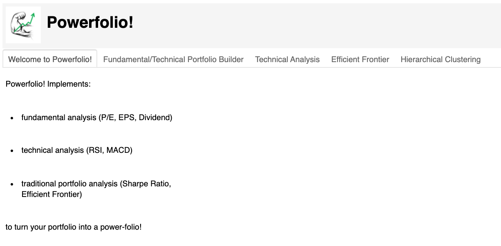

<br>

---


## Theory

## Fundamental Analysis
### P/E - Price to Earnings Ratio
The [price-to-earnings ratio (P/E ratio)](https://www.investopedia.com/terms/p/price-earningsratio.asp) is a method used to value a company by comparing the share price to the Earnings per Share (EPS). The price-to-earnings ratio is used a multiplier for company earnings. High P/E ratio means that the stock value is high compared to corporate earnings, and that the company may be overvalues, and vis-versa. 


<br>

### EPS - Earnings per Share
[Earnings per share (EPS)](https://www.investopedia.com/terms/e/eps.asp) is generally calculated by dividing company's profit by the outstanding shares of its common stock. EPS is a general way for a company to report it's profitability adjusted to it's marker capitalization. It is one of the general ways to evaluate corporate earnings.


<br>

### Dividend
A [dividend](https://www.investopedia.com/terms/d/dividend.asp) is the distribution of a company's earnings to its shareholders. Dividends are paid directly to shareholders of the company on periodic basis and the amount is determined by the board of directors.
<br>
<br>


## Technical Analysis
### RSI - Relative Strength Index
[Relative Strength Index](https://www.investopedia.com/terms/r/rsi.asp), better known as RSI is a technical indicator used to determine is a particular security is overbought or oversold. It measures the magnitude of price change of the asset; and is an oscillator that moves between 0 and 100. RSI was developed by J. Welles Wilder Jr. in 1978.

\begin{equation}RSI_{step\:one} = \left(\frac{100}{1+\frac{Average\: gain}{Average\:loss}}\right)\end{equation}


\begin{equation}RSI_{step\:two} = \left(\frac{100}{1+\frac{(Previous\:average\:gain\:\times\:13)\:+\:Current\:gain}{-((Previous\:average\:loss\:\times\:13)\:+\:Current\:loss)}}\right)\end{equation}

<br>

RSI indicator, indicates that a stock is overbought then the indicator crosses above 70%, and oversold when the indicator drops below 30%. Additionally, a trader may want to enter a position when RSI crosses above 30%, indicating bullish reversal, and exit a position when RSI drops below 70%, indicating bearish reversal.

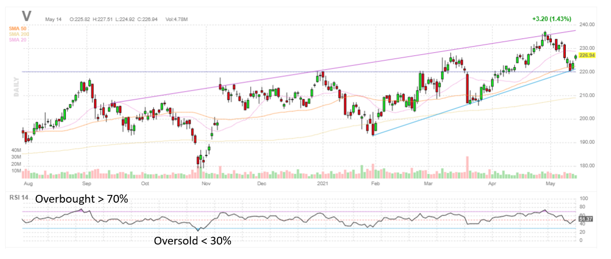

<br>


### MACD
[Moving average convergence divergence (MACD)](https://www.investopedia.com/terms/m/macd.asp) is a trend-following momentum indicator that shows the relationship between two moving averages of a security’s price. The MACD is calculated by subtracting the 26-period exponential moving average (EMA) from the 12-period EMA.

\begin{equation} MACD = 12\:Period\:EMA\:-\:26\:Period\:EMA  \end{equation}
<br>

[Exponential moving average](https://www.investopedia.com/terms/e/ema.asp) is a [moving average](https://www.investopedia.com/terms/m/movingaverage.asp) that places a greater weight to most recent data points and less to the older data points. In finance, EMA reacts more significantly to recent price changes than a [simple moving average (SMA)](, which applies an equal weight to all observations in the period.
In statistics, a moving average (MA), also known as simple moving average (SMA) in finance, is a calculation used to analyze data points by creating a series of averages of different subsets of the full data set. 

\begin{equation}EMA_{today} = \left( Value_{today} * \left(\frac{Smoothing}{1\:+\:Days}\right) \right)\:+\:EMA_{yesterday}\:*\:\left(1\:-\:\frac{Smoothing}{1\:+\:Days}\right)\end{equation}


MACD is used by traders to indicate bullish and bearish reversals when the EMA trendlines cross.

<br>

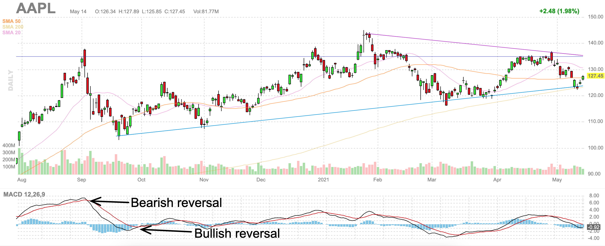

<br>


## Traditional Analysis
### Sharpe Ratio
[Sharpe Ratio](https://www.investopedia.com/terms/s/sharperatio.asp) allows user understand the return of an investment compared to the risk of the investment. Sharpe Ratio is the average return earned above the risk-free rate compared to volitility of the investment. [Volatility](https://www.investopedia.com/terms/v/volatility.asp) is a measure of the price fluctuations of an asset or portfolio. The Sharpe ratio was developed by Nobel laureate [William F. Sharpe](https://en.wikipedia.org/wiki/William_F._Sharpe) in 1966. 


<br>

\begin{equation} Sharpe\:Ratio=\frac{R_p\:-\:R_f}{\sigma_p}\end{equation}

where:

* *R<sub>p</sub>* = return of portfolio
* *R<sub>f</sub>* = risk-free rate
* *σ<sub>p</sub>* = standard deviation of the portfolio’s excess return


Subtracting the risk-free rate from the retuns allows the user to isolate the profits from the cost of money. The risk-free rate of return usually identified by the [10-year U.S. Government Bond Yield](https://www.treasury.gov/resource-center/data-chart-center/interest-rates/Pages/TextView.aspx?data=yield), although in some instances risk-free rate may be identified as passive returns from investment in an index such as S&P 500, as that kind of investment may be considered the true cost of money.

Greater Sharpe Ratio is accosiated with a greater rist-adjusted return.
<br>

### Efficient Frontier
The [Efficient Frontier](https://www.investopedia.com/terms/e/efficientfrontier.asp) is the collection of portfolios optimized for the highest expected return normalized to a specified level of risk. Portfolios that lie below the efficient frontier are sub-optimal because they do not provide enough return for the level of risk. Portfolios that cluster to the right of the efficient frontier are sub-optimal because they have a higher level of risk for the defined rate of return.

*The plot was taken from [TheWealthyFinn.com](https://www.thewealthyfinn.com/2019/07/risk-return-modern-portfolio-theory.html):*


<br>

[Harry Markowitz](https://en.wikipedia.org/wiki/Harry_Markowitz) has introduced the Efficient Frontier in 1952 and made it the cornerstone of [modern portfolio theory](https://www.investopedia.com/terms/m/modernportfoliotheory.asp) (MPT).

<br>


### Hierarchical Clustering
Hierarchial Rist Clustering utilizes [hierarchial risk parity](https://quantpedia.com/hierarchical-risk-parity/) ...

*The plot was taken from [QuantPedia.com](https://quantpedia.com/hierarchical-risk-parity/):*

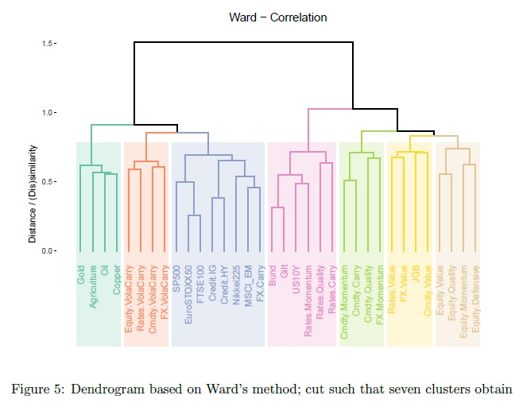


<br>
<br>

---

## Installation
### Anaconda
[Anaconda](https://docs.anaconda.com/) is a package manager, an environment manager, a Python/R data science distribution, and a collection of over open-source packages. 

#### Installation
[Anaconda Installation](https://docs.anaconda.com/anaconda/install/)

<br>

### Jupyter
Powerfolio! is contained within a Jupyter Notebook. 
Project Jupyter exists to develop open-source software, open-standards, and services for interactive computing across dozens of programming languages. [[Jupyter Project Overview](https://jupyter.org/install)]

#### Installation
```python
pip install jupyterlab
```

<br>

### pandas
pandas is an open source, BSD-licensed library providing high-performance, easy-to-use data structures and data analysis tools for the Python programming language. [[Pandas Overview](https://pandas.pydata.org/pandas-docs/stable/getting_started/index.html)]


#### Installation
```python
conda install pandas
```

<br>

### NumPy
The fundamental package for scientific computing with Python [[Numpy Overview](https://numpy.org/)]

#### Installation
```python
conda install numpy
```

<br>

### Scipy
SciPy is a Python-based ecosystem of open-source software for mathematics, science, and engineering. [[Scipy Overview](https://www.scipy.org/install.html)]

#### Installation
```python
python -m pip install --user scipy ipython sympy nose
```

<br>

### matplotlib
Matplotlib is a comprehensive library for creating static, animated, and interactive visualizations in Python. [[matplotlib Overview](https://matplotlib.org/)]

#### Installation
```python
conda install matplotlib
```

<br>

### Panel
A high-level app and dashboarding solution for Python [[Holoviz Panel Overview](https://panel.holoviz.org/)]

#### Installation
```python
conda install -c pyviz panel
```

<br>

### Plotly
Interactive charts and maps for Python, R, and JavaScript. [[Plotly Overview](https://plotly.com/python/getting-started/)]

#### Installation
Plotly must be installed inside the environment where it is meant to be used.

```python
conda install -c plotly plotly
```

<code>ipywidgets</code> and Jupyter Lab extensions must be added prior to Plotly's use

```python
conda install "notebook>=5.3" "ipywidgets>=7.5"
jupyter labextension install jupyterlab-plotly@4.14.3
jupyter labextension install @jupyter-widgets/jupyterlab-manager plotlywidget@4.14.3
```

<br>

### hvPlot
A high-level plotting API for the PyData ecosystem built on HoloViews. [[hvPLot Overview]](https://hvplot.holoviz.org/)

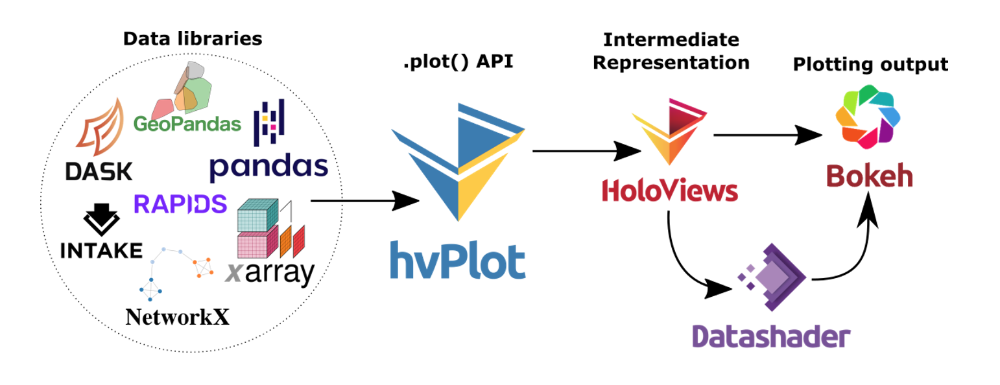


#### Installation
```python
conda install -c pyviz hvplot
```

For Jupyter Notebook support:
```python
jupyter labextension install @pyviz/jupyterlab_pyviz
```

<br>

### Seaborn
Seaborn is a Python data visualization library based on matplotlib. It provides a high-level interface for drawing attractive and informative statistical graphics. [[Seaborn Overview](https://seaborn.pydata.org/installing.html)]

#### Installation
```python
conda install seaborn
```

<br>

## APIs

### Matplotlib
Matplotlib is a comprehensive library for creating static, animated, and interactive visualizations in Python. [[Matplotlib Overview](https://matplotlib.org/)]

#### Installation
```python
conda install matplotlib
```

<br>

### Alpaca Trade API
Alpaca is a technology company headquartered in Silicon Valley that builds commission-free stock trading API (Brokerage services are provided by Alpaca Securities LLC, member FINRA/SIPC) [[Alpaca Trade API Overview](https://alpaca.markets/docs/)]. 

*A user API key is required.*

<br>

#### Installation
```python
pip install alpaca-trade-api
```
<br>

### Quandl
The premier source for financial, economic and alternative datasets, serving investment professionals. Nasdaq’s Quandl platform is used by analysts from the world’s top hedge funds, asset managers and investment banks. [[Quandl API Overview](https://www.quandl.com/docs-and-help)]. 

*A user API key is required.*

<br>

#### Installation
```python
conda install -c anaconda quandl
```

<br>

### FinnHub
Real-Time RESTful APIs and Websocket for Stocks, Currencies, and Crypto. [[FinnHub API Overview](https://finnhub.io/docs/api/introduction)]

*A user API key is required.*

#### Installation
```python
pip install finnhub-python
```

<br>

---

## Using the Dashboard
### Data Connections
Data connections in the Powerfolio! Dashboard are provided by [Alpaca](https://alpaca.markets/docs/), [Quandl](https://www.quandl.com/docs-and-help), and [Finnhub](https://finnhub.io/docs/api/introduction).

* The securities for analysis are presented in a <code>.csv</code> file store locally. 
* Alpaca Trade API provides marker High, Low, Open, Close and Volume data. An API key is required. The API calls are performed live.
* Quandl API provides risk-free-rate data for Sharpe Ratio calculation
* FinnHub provides fundamental data. The data is stored locally in a <code>.csv</code> sheet and needs to be updated periodically.


#### Securities tickers 
Securities tickers are stored locally and can be replaced on demand.
The column with tickers within the .csv file must be named <code>"Symbol"</code>


The data from the default <code>.csv</code> contains S&P 500 tickers in the following format:

| Symbol | Security |             GICS Sector |      GICS Sub-Industry |                      Headquarters Location |        Date first added |        CIK | Founded |             |
|-------:|---------:|------------------------:|-----------------------:|-------------------------------------------:|------------------------:|-----------:|--------:|-------------|
|     11 |        A |    Agilent Technologies |            Health Care |                      Health Care Equipment | Santa Clara, California |   6/5/2000 | 1090872 |        1999 |
|     28 |      AAL | American Airlines Group |            Industrials |                                   Airlines |       Fort Worth, Texas |  3/23/2015 |    6201 |        1934 |
|      8 |      AAP |      Advance Auto Parts | Consumer Discretionary |                          Automotive Retail | Raleigh, North Carolina |   7/9/2015 | 1158449 |        1932 |
|     45 |     AAPL |              Apple Inc. | Information Technology | Technology Hardware, Storage & Peripherals |   Cupertino, California | 11/30/1982 |  320193 |        1977 |
|      2 |     ABBV |             AbbVie Inc. |            Health Care |                            Pharmaceuticals | North Chicago, Illinois | 12/31/2012 | 1551152 | 2013 (1888) |

<br>


#### API keys
    
The user needs to store the API keys locally and reference them in the <code>dashboard.ipynb</code> before running the application. 
In order to reference the API keys enter the filepath of your <code>.env</code> file in code cell 3 of the notebook:


    
    
In order to properly load API keys using <code>dotenv</code> library the key names in the file must be:
 

| API Key Type                | .env variable     |
|-----------------------------|-------------------|
| Alpaca Trade API key        | ALPACA_API_KEY    |
| Alpaca Trade API secret key | ALPACA_SECRET_KEY |
| FinnHub API key             | FINNHUB_API_KEY   |
    
<br>


### FinnHub Data Refresh
FinnHub data is stored locally in a <code>.csv</code> and can be refreshed on the Welcome page of the Dashboard:

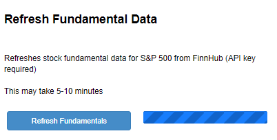

<br>

FinnHub generated fundamental data is stored in a <code>fundamental_data.csv</code> file, the path of which can be changed on-demand:


<br>

---


## Computational Methods

### Fundamental and Technical Portfolio Builder
Fundamental/Technical Portfolio Builder tab contains the tools necessary to build a model portfolio, or shall we say, Powerfolio!

Fundamental model portfolio builder scans securities provided in the locally stored <code>.csv</code> file and returns securities that fit the user input criteria.

The selection criteria for the model portfolio are:

> Start date

> End date

> P/E range

> EPS range

> Dividend range

Pressing the <code>Apply selection</code> button refreshes the **Filtered Stocks** Dataframe and plots the model fundamental portfolio.
**Filtered Stocks** Dataframe is sortable and interactive.

Pressing <code>Refresh</code> button clears the **Filtered Stocks** Dataframe.

<br>

*Fundamental Portfolio Screener/Builder GUI*:


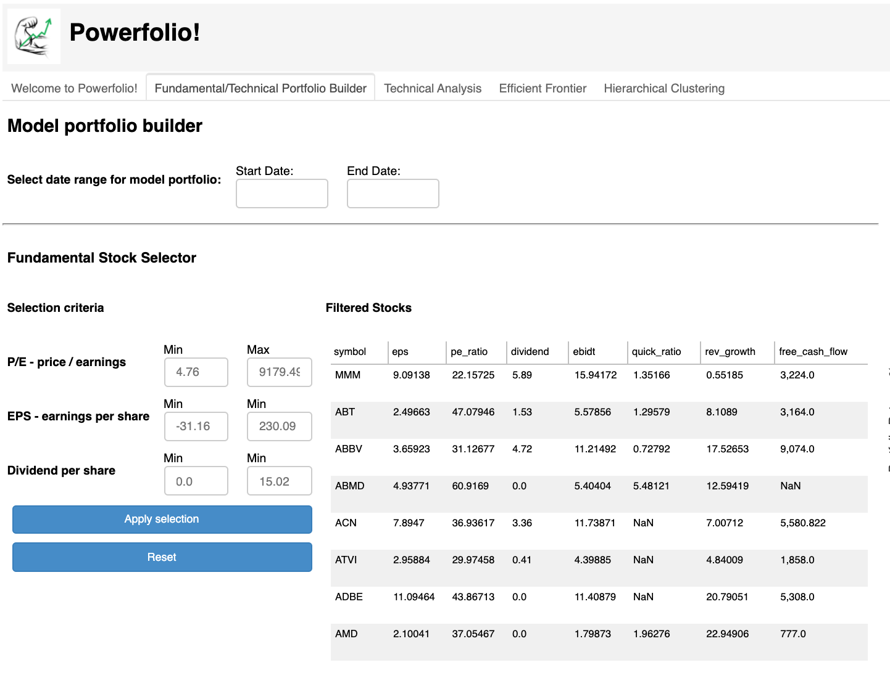

<br>

The model fundamental portfolio is displayed on the right side of the Dashboard.
*Fundamental Portfolio Screener/Builder result*:

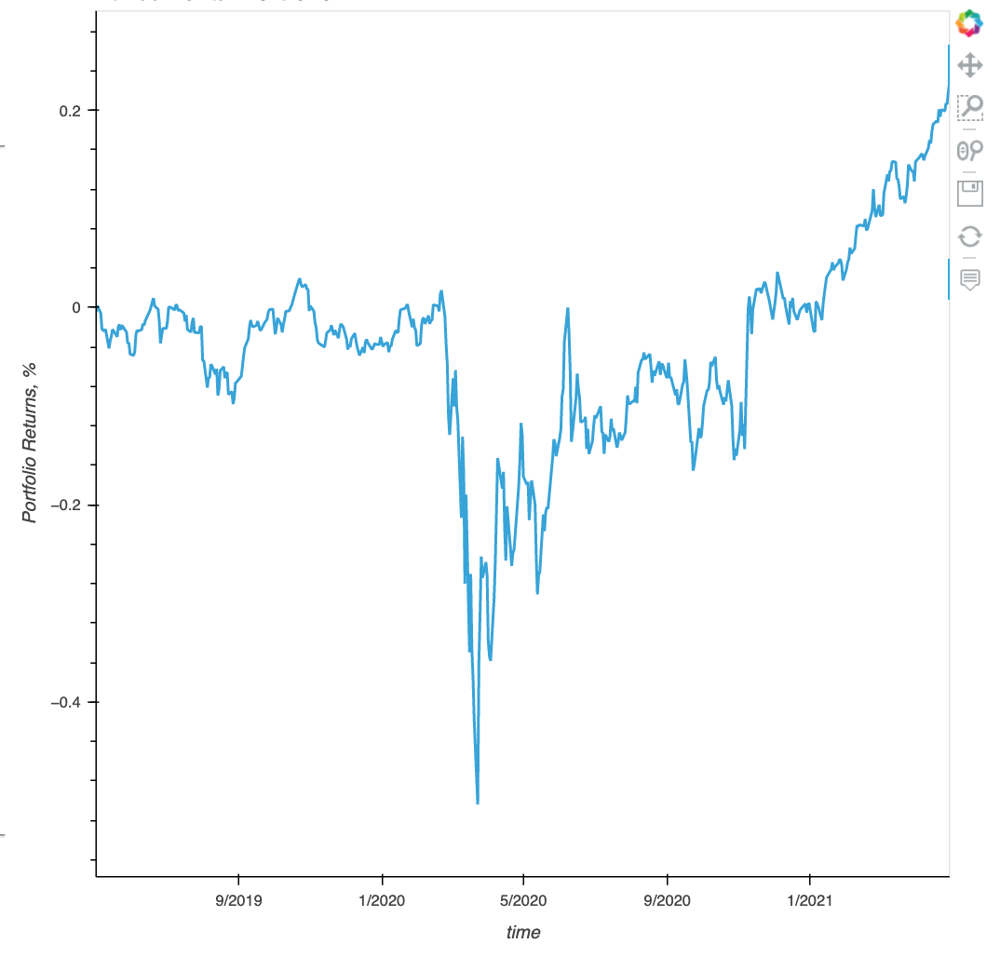

<br>


### RSI Trader
Powerfolio! utilizes [Relative Strength Index (RSI)](#technical-analysis) in order to build a model-based portfolio. The strategy is based solely on “crossovers” signals derived from the RSI values. The strategy will buy/close a position while crossing upward the oversold level and will trigger a sell/close signal while crossing the overbought signal downward. Generally an RSI value of 30 is considered oversold and RSI value of 70 is considered overbought. However the user can select different values for the oversold/overbought levels.
Typically RSI is used while scanning divergences but we haven’t explored this path yet.

RSI Trader GUI allows user to enter the lower and upper RSI bounds as well as the number of days for the moving average.

The selection criteria for the model portfolio are:

> Min

> Max

> RSI Lenght

<br>

*RSI Builder GUI*:

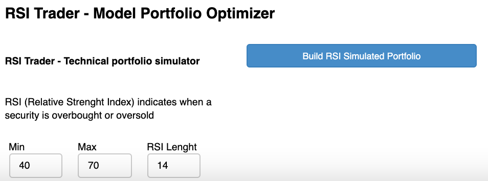

<br>


The resulting plot shows the RSI Trader simulated portfolio in addition to model fundamental portfolio. This allows the user to compare the portfolios on one plot. The RSI Trader GUI allows user to change input selection and generate additional portfolios in order to best compare different trade entry and exit points.

*RSI Builder result*:

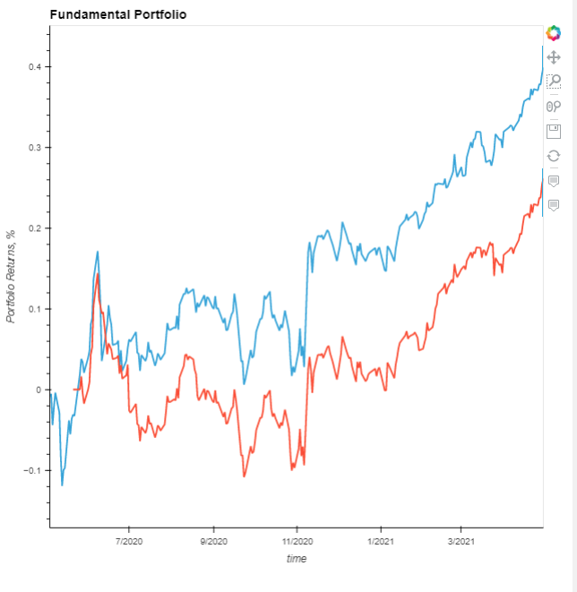

<br>

### Technical Analysis Viewer
Technical Analysis tab contains a tool that allows the user to view technical indicators for each of the securities in the Fundamental/Technical Portfolio that was generated on the previous tab. 

It provides the user with:

> RSI

> Price

> Volume

> MACD

The user can select the tickers for the securities within their portfolio in the drop-down menu on the top left side of the screen and pressing the <code>View Technical Indicators</code> button. 

*Technical Analysis GUI and result:*

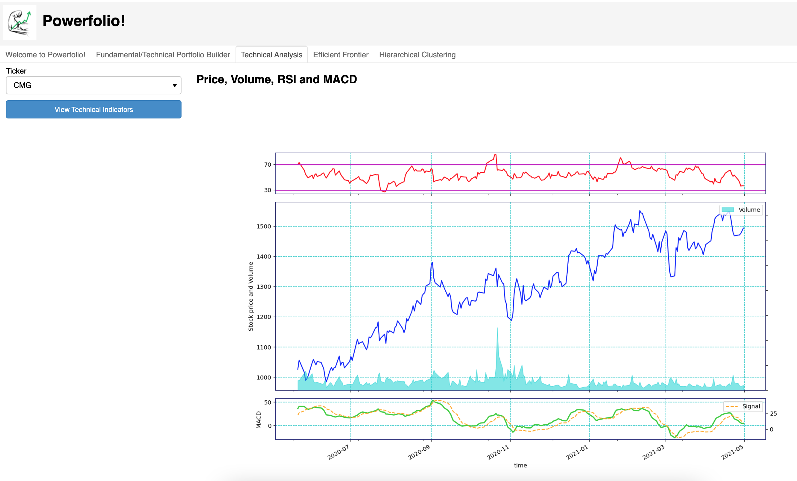

<br>


### Efficient Frontier Results
Efficient Frontier tab allows user to model an efficient portfolio and compare it to the Fundamental Model Portfolio that the user hasa generated previously.


*Efficient Frontier GUI and results*:

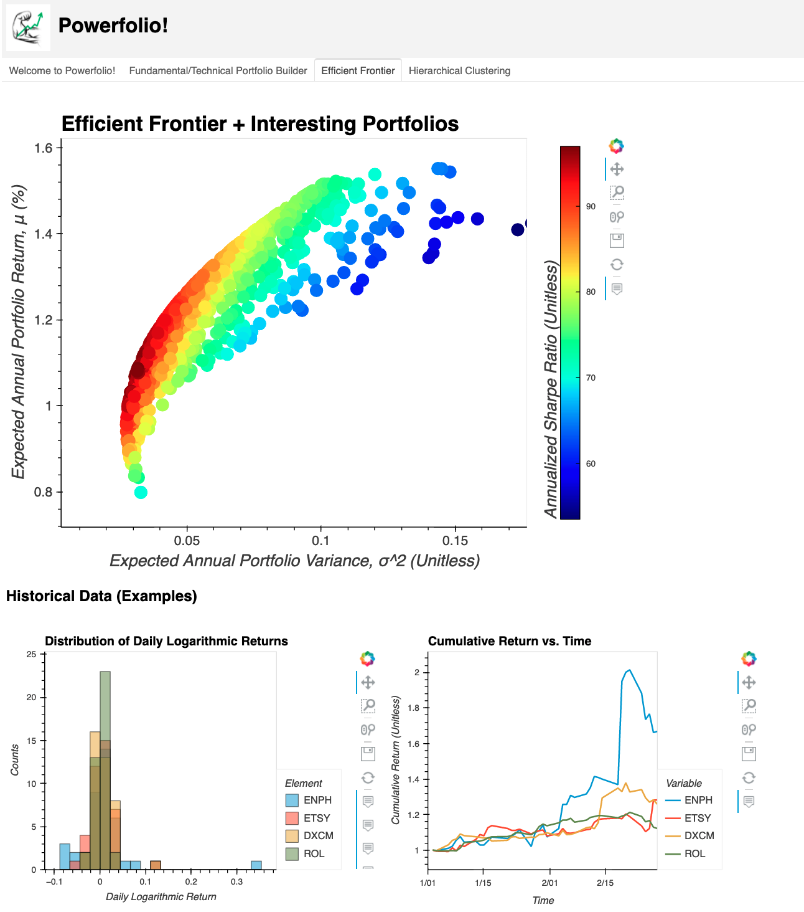


### Hierarchical Clustering Results
...


*Hierarchical Clustering result*:

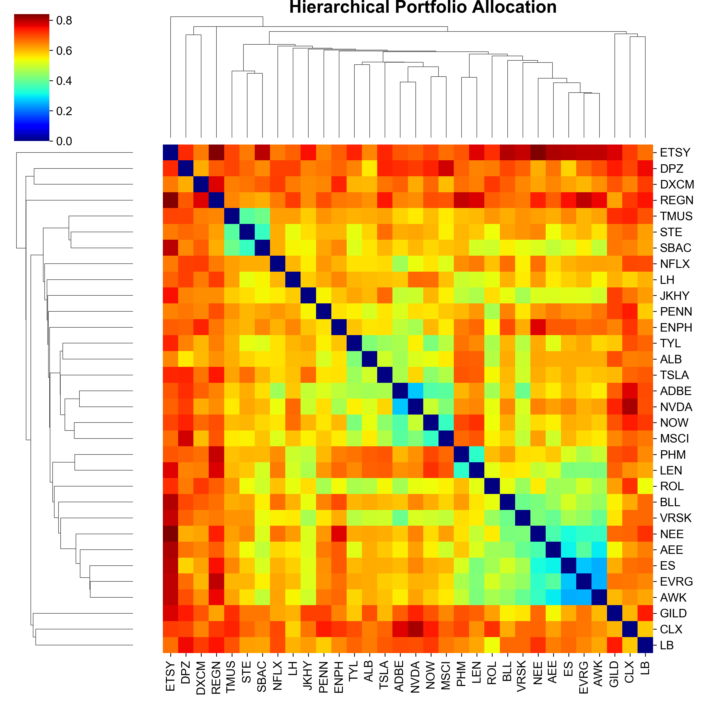


---

## 

<br>
<br>
